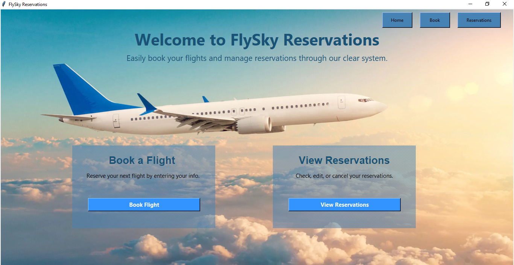
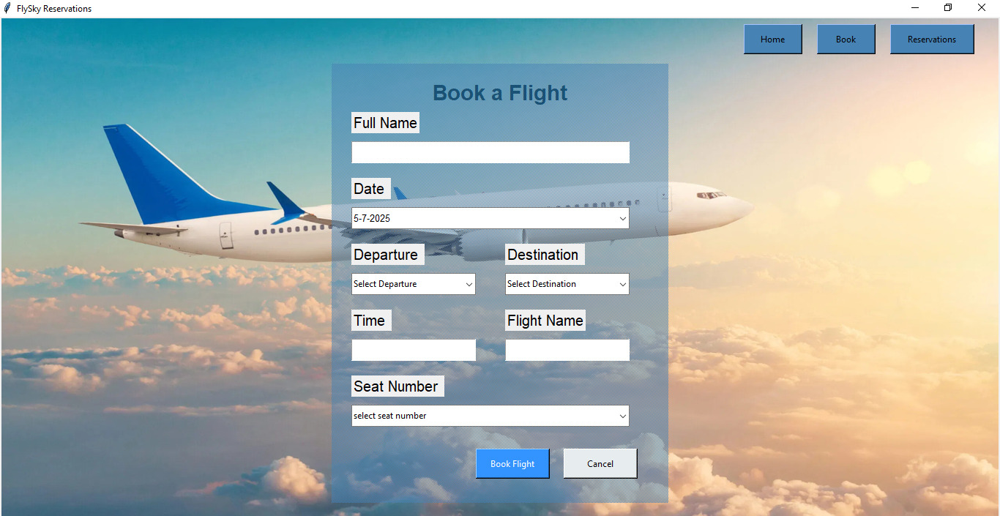
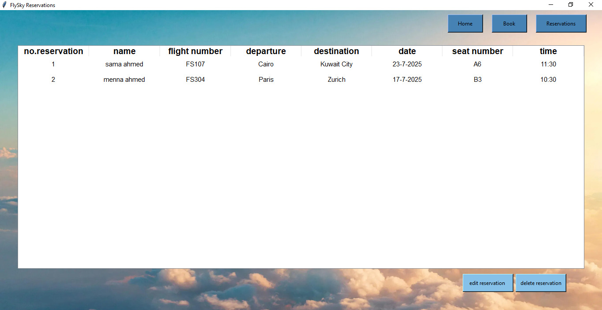

# ✈ FlySky Reservation System

This is a simple desktop application for booking and managing flight reservations.  
Built using Python and Tkinter, it offers an easy-to-use graphical interface.

## 🖥  Features

- ✅ Book flights with passenger information
- 🧾 View all reservations
- ✏ Edit and update reservation details
- ❌ Delete reservations
- 🎨 Beautiful background and semi-transparent cards using Canvas
- 💾 Data stored locally using SQLite3
## 📁 Project Structure
- Flight-Reservation-App

- main.py                : Entry point
- database.py            : DB connection and queries
- home.py                : Home screen UI
- booking.py             : Booking form page
- reservations.py        : Reservation list and delete/edit
- edit_reservation.py    : Edit form popup
- requirements.txt       : Python libraries used
- flights.db             : SQLite database file
- background.jpg         : Background image
- README.md              : This file

## 🧠 Project Logic Summary
The application follows a modular design where main.py loads different screens (Home, Booking, Reservations) dynamically based on user actions. The flight schedule logic is linked to real-world patterns: users select a date, and based on the day of the week, the app fetches only the available flight routes, departure points, and destinations for that day.

Flight name and time are auto-filled based on the selected route, and seats are selected from a realistic aircraft seating plan. The app uses Tkinter + Canvas for a styled interface, tkcalendar for date picking, and SQLite3 for persistent local data storage. All DB logic (insert, update, delete) is abstracted in a clean database.py module.

## 🚀 Installation & Running

1. Clone the repository:
   ```bash
   git clone https://github.com/sama-amer412/flight-reservation-app.git
   cd flight-reservation-app 
   ```
2. Install dependencies:
   ```bash
   pip install -r requirements.txt
   ```
3. Run the app:
   ```bash
   python main.py
   ```

## 📸 Screenshots

### 🏠 Home Page


### 📑 Booking Page


### 📋 Reservation Page


## 🛠 Technologies Used

- Python – Core programming language
Tkinter – GUI framework for desktop apps
tkcalendar – Calendar widget for date selection
SQLite3 – Lightweight embedded database
ttk – Styled widgets for enhanced UI

## 📝 License
This project is for educational purposes only.

## 🙋‍♀ Author
**Sama Amer**

- 💼 LinkedIn: [linkedin.com/in/sama-amer-644179364](https://www.linkedin.com/in/sama-amer-644179364)

- 💻 GitHub: [github.com/sama-amer412](https://github.com/sama-amer412)

